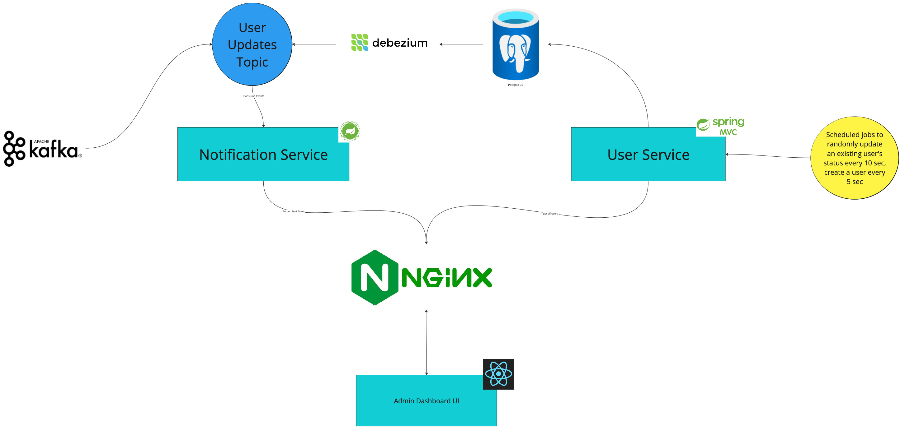

# Realtime Admin Dashboard
A proof of concept for utilising server sent events to show user updates and creation.With Kafka and Debezium CDC to communicate between microservices.



The project has been deployed and available here: https://www.andrew-app.dev/projects/admin-dashboard/

## Getting started

The entire project can be run locally using Docker Compose. This will spin up Kafka, Postgres DB, Spring Web and Webflux microservices and the UI.

```
docker-compose up
```
Then visit http://localhost:3000
